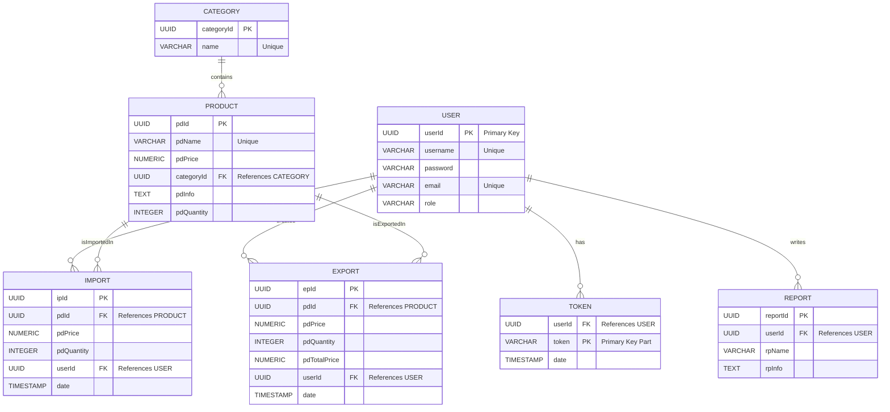
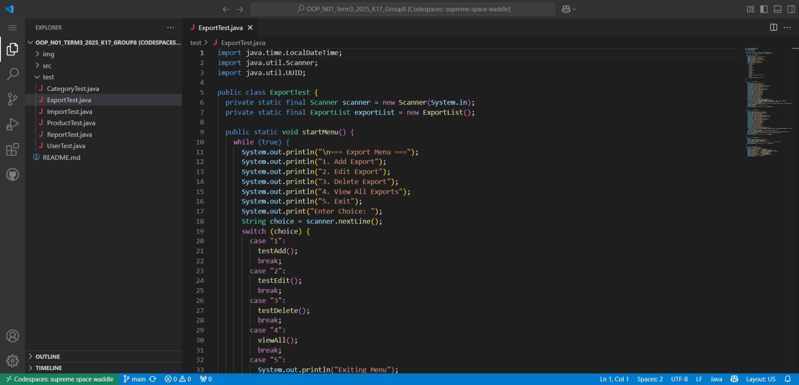

# **Store Inventory Management System**  
<p align="center">
  
</p>
  
## **I - Introduction**  
A CRUD-Based Web Application For Managing Store Inventory Operations - Developed With Spring Boot MVC + Thymeleaf + PostgreSQL/MySQL. This System Enables Comprehensive Control Over Products, Categories, Imports, Exports, Users, Reports Through An Intuitive Dashboard.
  
---
  
## **II - Features**  
- Dashboard Overview With Statistics  
- User Authentication  
- Category Management  
- Product Management  
- Import Product Entries  
- Export Product Sales  
- Auto-Calculated Export Totals  
- Report Generation  
- Token-Based Session Handling  
- Data Visualization
- Excel + PDF Export  
  
---
  
## **III - Database Design**  
  
### 1. User  
_Manages Authorization_
  
| Field    | Type   | Description                    |
|----------|--------|--------------------------------|
| userId   | UUID   | Unique Identifier              |
| username | String | Username                       |
| password | String | Password                       |
| email    | String | Contact Email                  |
| role     | String | User Role                      |
  
---
  
### 2. Token  
_Handles User Sessions_
  
| Field  | Type   | Description                          |
|--------|--------|--------------------------------------|
| userId | UUID   | Linked To User - FK                  |
| token  | String | Unique Session Token                 |
| date   | Date   | Time Of Token Creation               |
  
---
  
### 3. Category  
_Groups Products For Better Management_
  
| Field      | Type   | Description            |
|------------|--------|------------------------|
| categoryId | UUID   | Unique Category ID     |
| name       | String | Category Name          |
  
---
  
### 4. Product  
_Represents Store Products_
  
| Field       | Type     | Description                          |
|-------------|----------|--------------------------------------|
| pdId        | UUID     | Unique Product ID                    |
| pdName      | String   | Product Name                         |
| pdPrice     | Decimal  | Unit Price Of Product                |
| categoryId  | UUID     | Linked Category - FK                 |
| pdInfo      | Text     | Product Description                  |
| pdQuantity  | Integer  | Quantity In Stock                    |
  
---
  
### 5. Import  
_Tracks Incoming Inventory_
  
| Field      | Type     | Description                                |
|------------|----------|--------------------------------------------|
| ipId       | UUID     | Unique Import Record ID                    |
| pdId       | UUID     | Imported Product ID - FK                   |
| pdPrice    | Decimal  | Import Price Per Unit                      |
| pdQuantity | Integer  | Quantity Imported                          |
| userId     | UUID     | Handled By User - FK                       |
| date       | DateTime | Date Of Import                             |
  
---
  
### 6. Export  
_Tracks Outgoing Inventory_
  
| Field        | Type     | Description                                         |
|--------------|----------|-----------------------------------------------------|
| epId         | UUID     | Unique Export Record ID                             |
| pdId         | UUID     | Exported Product ID - FK                            |
| pdPrice      | Decimal  | Export Price Per Unit                               |
| pdQuantity   | Integer  | Quantity Exported                                   |
| pdTotalPrice | Decimal  | Auto-Calculated As pdPrice × pdQuantity             |
| userId       | UUID     | Handled By User - FK                                |
| date         | DateTime | Date Of Export                                      |
  
---
  
### 7. Report  
_Custom User Reports_
  
| Field     | Type   | Description                   |
|-----------|--------|-------------------------------|
| reportId  | UUID   | Unique Report ID              |
| userId    | UUID   | Created By User - FK          |
| rpName    | String | Report Name                   |
| rpInfo    | Text   | Report Content                |
  
---
  
## **IV - Used Technologies**  
- **Frontend:** HTML, CSS, Javascript, Thymeleaf  
  <a href="https://github.com/VAK42"></a>  
- **Backend:** Java, Spring Boot, Hibernate ORM  
  <a href="https://github.com/VAK42"></a>  
- **Database:** PostgreSQL, MySQL  
  <a href="https://github.com/VAK42"></a>  
- **Data Visualization:** Chart JS  
- **Testing:** JUnit, Mockito  
- **Version Control:** Github  
  <a href="https://github.com/VAK42"></a>  
- **IDE & Text Editor:** IntelliJ IDEA, VSCodium  
  <a href="https://github.com/VAK42"></a>  
  
---
  
## **V - Project Structure**  
  
### Architecture: MVC (Model - View - Controller)  
  
- Controller: Handles Routing & Request Processing  
- Model: Entity & Domain Classes  
- Repository: JPA Interfaces For Database Access  
- Service: Business Logic Layer  
  
---
  
## **VI - Folder Structure**  
  
```plaintext
.
├── .mvn/wrapper
│   └── maven-wrapper.properties
├── pom.xml
├── mvnw.cmd
├── src
│   └── main
│       ├── java/com/vak/oop
│       │   ├── controller
│       │   │   ├── CategoryController.java
│       │   │   ├── DashboardController.java
│       │   │   ├── ExportController.java
│       │   │   ├── ImportController.java
│       │   │   ├── ProductController.java
│       │   │   ├── ReportController.java
│       │   │   ├── RequestControllerAdvice.java
│       │   │   └── UserController.java
│       │   ├── model
│       │   │   ├── Category.java
│       │   │   ├── Export.java
│       │   │   ├── Import.java
│       │   │   ├── Product.java
│       │   │   ├── Report.java
│       │   │   └── User.java
│       │   ├── repository
│       │   │   ├── CategoryRepository.java
│       │   │   ├── ExportRepository.java
│       │   │   ├── ImportRepository.java
│       │   │   ├── ProductRepository.java
│       │   │   ├── ReportRepository.java
│       │   │   └── UserRepository.java
│       │   └── service
│       │       ├── CategoryService.java
│       │       ├── ExportService.java
│       │       ├── ImportService.java
│       │       ├── ProductService.java
│       │       ├── ReportService.java
│       │       └── UserService.java
│       └── resources
│           ├── application.properties
│           ├── VAK.sql
│           ├── static
│           │   ├── OOP.js
│           │   ├── OOP.png
│           │   ├── VAK.css
│           │   └── VAK.js
│           └── templates
│               ├── category
│               │   ├── form.html
│               │   └── list.html
│               ├── dashboard
│               │   └── index.html
│               ├── export
│               │   ├── form.html
│               │   └── list.html
│               ├── import
│               │   ├── form.html
│               │   └── list.html
│               ├── product
│               │   ├── form.html
│               │   └── list.html
│               ├── report
│               │   ├── form.html
│               │   └── list.html
│               └── user
│               |   ├── form.html
│               |   └── list.html
│               └── index.html
├── test/java/com/vak/oop/controller
│   ├── CategoryControllerTest.java
│   ├── ReportControllerTest.java
│   └── UserControllerTest.java
```
  
---
  
## **VII - Models & Functionality**  
  
### 1. User  
  
#### Fields  
- **UserId**: Unique Identifier For Each User  
- **Username**: Login Name Chosen By The User  
- **Password**: Encrypted Password Used For Authentication  
- **Email**: User's Email Address  
- **Role**: Defines The User's Permissions  
  
#### Functions  
- **Login**: Authenticates User Credentials And Initiates A Session  
- **Role Validation**: Checks User Role To Control Access  
- **Token Association**: Links The User To An Authentication Token  
- **Register User**: Allows Creation Of New Users With Roles  
- **Update Profile**: Enables Changes To Personal Info Or Password  
- **Deactivate Account**: Disables Login Access If Needed  
  
### 2. Token  
  
#### Fields  
- **Token**: Unique String Assigned To A Logged-In Session  
- **UserId**: Links Token To A Specific User  
- **Date**: Timestamp When The Token Was Issued  
  
#### Functions  
- **Session Authentication**: Verifies Token Validity  
- **Token Refresh**: Issues A New Token Before Expiration  
- **Expiration**: Invalidates Token After Inactivity Or Time Limit  
- **Token Revocation**: Manually Ends A User's Session  
  
### 3. Category  
  
#### Fields  
- **CategoryId**: Unique Identifier For Each Category  
- **Name**: Descriptive Name Of The Category  
  
#### Functions  
- **Add Category**: Creates A New Product Category  
- **Update Category**: Modifies Name Or Status  
- **Delete Category**: Removes Category  
- **List Categories**: Retrieves All Categories  
- **Validate Uniqueness**: Prevents Duplicate Names  
  
### 4. Product  
  
#### Fields  
- **PdId**: Unique Identifier For Each Product  
- **PdName**: Name Of The Product  
- **PdPrice**: Unit Price Of The Product  
- **CategoryId**: Associates Product With A Category  
- **PdInfo**: Additional Product Description  
- **PdQuantity**: Current Stock Quantity  
  
#### Functions  
- **Add Product**: Adds A New Product  
- **Edit Product**: Updates Product Details  
- **Delete Product**: Removes A Product From Inventory  
- **Search Products**: Filters By Name, Category, Price  
- **Adjust Stock**: Updates Quantity Based On Imports/Exports  
- **Get Product Details**: Displays Full Product Info  
  
### 5. Import   
  
#### Fields  
- **IpId**: Unique ID For Each Import Transaction  
- **PdId**: Product Being Imported  
- **PdPrice**: Purchase Price Per Unit  
- **PdQuantity**: Quantity Imported  
- **UserId**: User Who Registered The Import  
- **Date**: Date And Time Of Import  
  
#### Functions  
- **Register Import**: Logs Import Details & Updates Stock  
- **Stock Management**: Increases Inventory Count  
- **View Import History**: Lists Past Imports  
- **Cost Analysis**: Tracks Price Variations  
  
### 6. Export  
  
#### Fields  
- **EpId**: Unique ID For Each Export/Sale Transaction  
- **PdId**: Product Being Sold  
- **PdPrice**: Selling Price Per Unit  
- **PdQuantity**: Quantity Sold  
- **PdTotalPrice**: Total Sale Value (Price × Quantity)  
- **UserId**: Staff Member Who Processed The Sale  
- **Date**: Date And Time Of Sale  
  
#### Functions  
- **Register Sale**: Logs Sale And Updates Stock  
- **Calculate Total**: Computes Sale Amount  
- **Reduce Stock**: Decreases Inventory Count  
- **View Sales History**: Displays Past Sales  
- **Check Stock Before Sale**: Validates Stock Availability  
  
### 7. Report  
  
#### Fields  
- **ReportId**: Unique Identifier For Each Report  
- **UserId**: Creator Or Owner Of The Report  
- **RpName**: Title Of The Report  
- **RpInfo**: Detailed Content Or Summary  
  
#### Functions  
- **Generate Report**: Compiles Data For Reporting  
- **Store Report**: Saves Report For Later Viewing  
- **Display Report**: Visualizes Report As Tables/Charts  
- **Export Report**: Downloadable In PDF, Excel  
- **Share Report**: Grants Access To Others  
  
---
  
## **VIII - Diagrams**  
- Class Diagram  
    
  

  
- Behavioural Diagram  

```mermaid
flowchart TB
    Start([Start])
    Start --> Login[Admin Logs In]
    Login --> CheckAdmin{Is Admin?}
    CheckAdmin -- Yes --> Dashboard[Go To Dashboard]
    CheckAdmin -- No --> End([End])

    Dashboard --> ViewDashboard[View Data Visuals]

    ViewDashboard --> UsersList[View User List]
    UsersList --> AddUser[Create New User]
    AddUser --> UsersList
    UsersList --> EditUser[Edit Existing User]
    EditUser --> UsersList
    UsersList --> DeleteUser[Delete User]
    DeleteUser --> UsersList

    UsersList --> ProductsList[View Product List]
    ProductsList --> AddProduct[Create New Product]
    AddProduct --> ProductsList
    ProductsList --> EditProduct[Edit Product]
    EditProduct --> ProductsList
    ProductsList --> DeleteProduct[Delete Product]
    DeleteProduct --> ProductsList

    ProductsList --> CategoriesList[View Category List]
    CategoriesList --> AddCategory[Create New Category]
    AddCategory --> CategoriesList
    CategoriesList --> EditCategory[Edit Category]
    EditCategory --> CategoriesList
    CategoriesList --> DeleteCategory[Delete Category]
    DeleteCategory --> CategoriesList

    CategoriesList --> ImportsList[View Import List]
    ImportsList --> AddImport[Create New Import]
    AddImport --> ImportsList
    ImportsList --> EditImport[Edit Import]
    EditImport --> ImportsList
    ImportsList --> DeleteImport[Delete Import]
    DeleteImport --> ImportsList

    ImportsList --> ExportsList[View Export List]
    ExportsList --> AddExport[Create New Export]
    AddExport --> ExportsList
    ExportsList --> EditExport[Edit Export]
    EditExport --> ExportsList
    ExportsList --> DeleteExport[Delete Export]
    DeleteExport --> ExportsList

    ExportsList --> ReportsList[View Report List]
    ReportsList --> AddReport[Create New Report]
    AddReport --> ReportsList
    ReportsList --> EditReport[Edit Report]
    EditReport --> ReportsList
    ReportsList --> DeleteReport[Delete Report]
    DeleteReport --> ReportsList

    ReportsList --> End
```
  

  
- Activity Diagram  
  

  
---
  
## **IX - Error Handling & Testing**  
  
- Try - Catch Blocks For Exception Management  
- JUnit For Unit Tests  
- Mockito For Mocking & Integration
  
- Category Test  
    
- Product Test  
    
- Import Test  
    
- Export Test  
    
- Report Test  
  
- User Test  
    
- General Test  
    
  
---
  
## **X - Instructions**  
  
### Requirements  
- JDK 24  
- PostgreSQL/MySQL  
- IntelliJ IDEA  
  
### Installation  
  
- Clone The Repository: git clone https://github.com/VAK42/OOP_N01_Term3_2025_K17_Group8.git  
  
- Navigate To The Project: cd OOP_N01_Term3_2025_K17_Group8  
  
- Configure Database In application.properties  
  
- Run The Application: ./mvnw.cmd spring-boot:run  
  
- Test The Application: ./mvnw.cmd test  
  
- Access The Application: https://localhost:8080  
  
---
  
## **XI - Team Members**  
  
*Vu Anh Kiet* - VAK42 (*) 
  
*Tran Ha Quang* - Babiboyy55 
  
*Pham Thi Minh Ngoc* - mcongie
  
---
  
## **XII - Individual Works**  
  
<table>
  <thead>
    <tr>
      <th>Team Member</th>
      <th>Modules Assigned</th>
      <th>Detailed Responsibilities</th>
    </tr>
  </thead>
  <tbody>
    <tr>
      <td><b><i>Vu Anh Kiet</i></b></td>
      <td>
        Base Initialization<br>
        Dashboard<br>
        Category<br>
        Product
      </td>
      <td>
        <b>Base Initialization</b>: Initialize Project Structure & Configuration<br>
        <b>Dashboard</b>: Integrate Summary Charts<br>
        <b>Category</b>: Implement Category CRUD<br>
        <b>Product</b>: Develop Product CRUD & Search & Filters
      </td>
    </tr>
    <tr>
      <td><b><i>Tran Ha Quang</i></b></td>
      <td>
        Export<br>
        Report
      </td>
      <td>
        <b>Export</b>: Register Sales Transactions & Calculate Totals<br>
        <b>Report</b>: Generate & Display & Export Reports
      </td>
    </tr>
    <tr>
      <td><b><i>Pham Thi Minh Ngoc</i></b></td>
      <td>
        Import<br>
        User
      </td>
      <td>
        <b>Import</b>: Register Product Imports & Maintain Import History<br>
        <b>User</b>: Manage User Information
      </td>
    </tr>
  </tbody>
</table>
  
---
  
## **XIII - Sources & Documents**  
- https://developer.mozilla.org/en-US/  
- https://www.thymeleaf.org/documentation.html  
- https://docs.spring.io/spring-boot/index.html  
- https://dev.java/learn/
- https://mvnrepository.com/
- https://hibernate.org/orm/documentation/7.0/
- https://www.postgresql.org/docs/
- https://dev.mysql.com/doc/
- https://www.chartjs.org/docs/latest/
- https://git-scm.com/doc
  
---
  
## XIV - Gallery  
  
- Dashboard  
    
- Category  
    
- Product  
    
- Import  
    
- Export  
    
- Report  
  
- User  
    

## XV - Future Integration  
  
- Authentication
- Confirmation Popup
